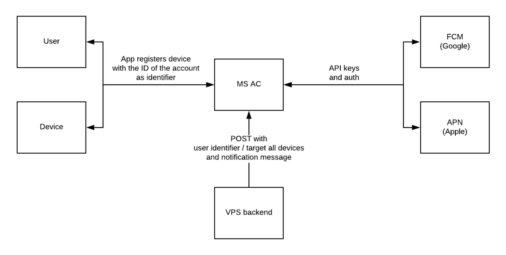
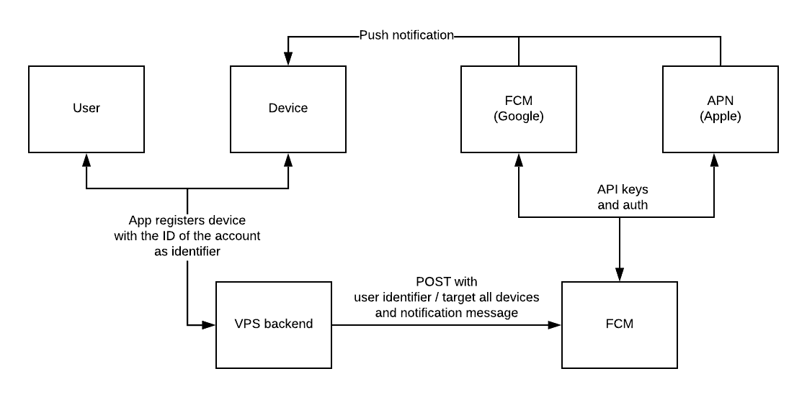

# Index
- [Index](#index)
  - [How push notifications work](#how-push-notifications-work)
    - [Sending notifications](#sending-notifications)
    - [Receiving / handeling notifications](#receiving--handeling-notifications)
  - [Microsoft App Center](#microsoft-app-center)
    - [Device IDs](#device-ids)
    - [Permission](#permission)
    - [Pricing](#pricing)
  - [Google Firebase Cloud Messaging](#google-firebase-cloud-messaging)
    - [Device IDs](#device-ids-1)
    - [Permissions](#permissions)
    - [Pricing](#pricing-1)
  - [General information](#general-information)

## How push notifications work

Push notifications on Android and iOS work via the [Firebase Cloud Messaging](https://firebase.google.com/docs/cloud-messaging) ([FCM](https://firebase.google.com/docs/cloud-messaging)) and [Apple Push Notification](https://developer.apple.com/notifications/) ([APN](https://developer.apple.com/notifications/)) platforms respectively. 

### Sending notifications

When sending notifications, you need to specify which device to send it to with a **Device ID**. Sending the message and the target to the notification platforms is all you need to do, the platforms will handle the rest.

This means that you need to keep track of which user is logged in on what device and save the Device ID in your database.

### Receiving / handeling notifications

When a user receives a notification, your app needs to know how to handle the notification. Don't forget [background and foreground notifications](https://firebase.google.com/docs/cloud-messaging/android/receive).

Handy table to fill in:

Push was received when... | Behaviour
--- | ---
App is open and foregrounded | ...
App is open and backgrounded, notification is not tapped	| ...
App is open and backgrounded, notification is tapped	| ...
App was not open, and then opened by selecting the push notification	| ...
App was not open, and then opened by tapping the home screen icon	| ...

## Microsoft App Center

- [Push package](https://www.npmjs.com/package/appcenter-push)
- [Push docs](https://docs.microsoft.com/en-us/appcenter/sdk/push/react-native-android)
- [SDK docs](https://docs.microsoft.com/en-us/appcenter/sdk/)

[Microsoft App Center](https://docs.microsoft.com/en-us/appcenter/) ([AP](https://docs.microsoft.com/en-us/appcenter/)) can do lots of things. It does two things for you regarding push notifications. It authenticates with FCM and APN and keeps track of which user is logged on to which device.

### Device IDs

**AP keeps track of which user has which Device ID**. Setting the user ID is done with [this method](https://docs.microsoft.com/en-us/appcenter/sdk/other-apis/react-native#identify-users):

```js
import AppCenter from 'appcenter'

AppCenter.setUserId("your-user-id")
```

The ID should be something that's already a unique identifier in your system, like the ID or email of the user. When you want to target the user, you simply pass the identifier you've decided to use to AP. AP knows which Device IDs are associated with it and sends the notification to those devices via FCM and APN.



### Permission

The app doesn't need explicit permissions for push notifications on Android. On iOS, the package will ask permission for us when the app launches.

### Pricing

The pricing information is a bit scattered, but:

- [Up to 1000 devices per audience and up to 200 max audiences](https://visualstudio.microsoft.com/app-center/pricing/)
- [Push: Unlimited push Notifications](https://docs.microsoft.com/en-us/appcenter/general/pricing)
- [Pay per monthly active devices targeted on 5 or more audience segments](https://azure.com/e/29b2794c2ffe4c6b91319355ac88ae47)

## Google Firebase Cloud Messaging

- [RNF]([@react-native-firebase/app](https://www.npmjs.com/package/@react-native-firebase/app)) and the [Messaging](https://www.npmjs.com/package/@react-native-firebase/messaging) package.
- [Docs](https://github.com/invertase/react-native-firebase/tree/master/packages/messaging)

### Device IDs

RNF doesn't keep track of the Device IDs for us, this is something we need to do ourselves. When a user logs in our out of the app, we can update the Device IDs in our database. This means that we need to provide the endpoint for updating the Device IDs



### Permissions

RNF does not ask permission for push notifiations for us, we need to do it ourselves.

### Pricing

FCM is completely free to use: [Pricing](https://firebase.google.com/pricing).

## General information

- The iOS Simulator doesn't support push notifications. You have to test on a physical device.
- The Android emulator does support push notifications, you just have to make sure that the Google Play Services package is installed.